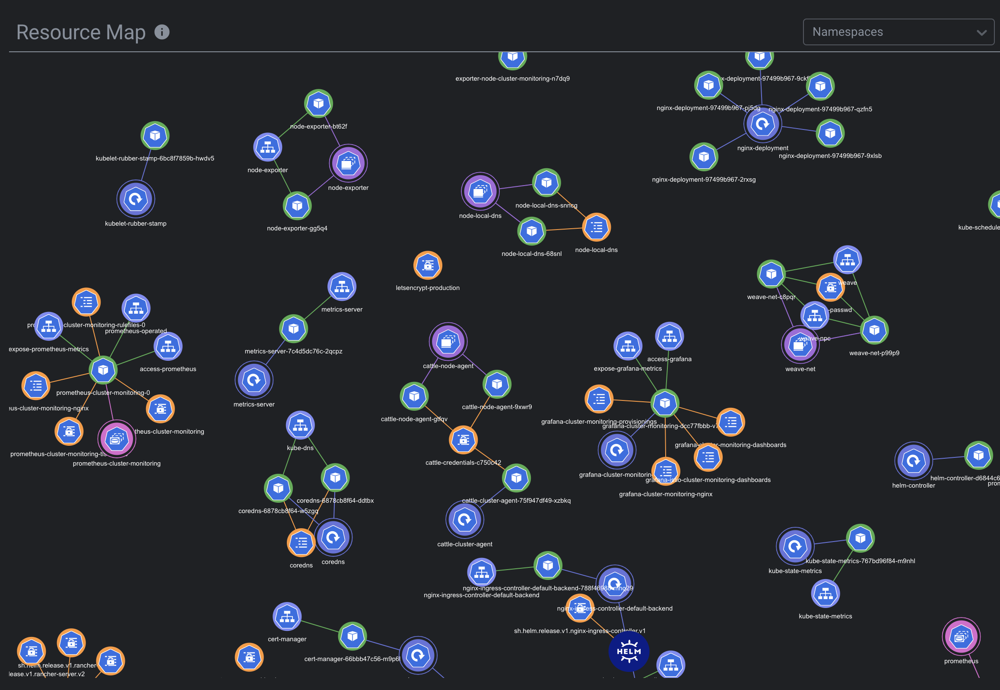

# Freelens Resource Map Extension


[](https://freelens.app)
[](https://github.com/freelensapp/freelens)
[](https://github.com/freelensapp/freelens-resource-map-extension)
[](https://github.com/freelensapp/freelens-resource-map-extension/actions/workflows/integration-tests.yaml)


## Overview 
The following is a description from the original repo : 

"Lens Resource Map is an extension for [Lens - The Kubernetes IDE](https://k8slens.dev) that displays Kubernetes resources and their relations as a real-time force-directed graph."




## Features

- Interactive graph visualization of Kubernetes resources
- Resource relationship mapping (pods, services, deployments, etc.)
- Namespace filtering
- Visual indicators for resource status and health
- Click navigation to resource details
- Access the resource map from its own dedicated tab or directly within the cluster's workload overview  
- See a focused mini-map of related resources when viewing details of a specific resource

## Requirements

- Kubernetes >= 1.24
- Freelens >= 1.6.0

## Install

To install open Freelens and go to Extensions (`ctrl`+`shift`+`E` or
`cmd`+`shift`+`E`), and install `@freelensapp/
freelens-resource-map-extension`.

## Build from the source

You can build the extension using this repository.

### Prerequisites

Use [NVM](https://github.com/nvm-sh/nvm) or
[mise-en-place](https://mise.jdx.dev/) or
[windows-nvm](https://github.com/coreybutler/nvm-windows) to install the
required Node.js version.

From the root of this repository:

```sh
nvm install
# or
mise install
# or
winget install CoreyButler.NVMforWindows
nvm install 22.21.1
nvm use 22.21.1
```

Install Pnpm:

```sh
corepack install
# or
curl -fsSL https://get.pnpm.io/install.sh | sh -
# or
winget install pnpm.pnpm
```

### Build extension

```sh
pnpm i
pnpm build
pnpm pack
```

One script to build then pack the extension to test:

```sh
pnpm pack:dev
```

### Install built extension

The tarball for the extension will be placed in the current directory. In
Freelens, navigate to the Extensions list and provide the path to the tarball
to be loaded, or drag and drop the extension tarball into the Freelens window.
After loading for a moment, the extension should appear in the list of enabled
extensions.

### Check code statically

```sh
pnpm lint:check
```

or

```sh
pnpm trunk:check
```

and

```sh
pnpm build
pnpm knip:check
```

### Testing the extension with unpublished Freelens

In Freelens working repository:

```sh
rm -f *.tgz
pnpm i
pnpm build
pnpm pack -r
```

then for extension:

```sh
echo "overrides:" >> pnpm-workspace.yaml
for i in ../freelens/*.tgz; do
  name=$(tar zxOf $i package/package.json | jq -r .name)
  echo "  \"$name\": $i" >> pnpm-workspace.yaml
done

pnpm clean:node_modules
pnpm build
```


## License
This project is licensed under the MIT License.  
Original work © [Lauri Nevala](https://github.com/nevalla) [ [kube-resource-map](https://github.com/nevalla/lens-resource-map-extension) ]

Freelens adaptation and initial update © 2025-2026 [Yasmine Gharbi](https://github.com/GHARBIyasmine)

Maintained collaboratively under the [Freelens](https://github.com/freelensapp) organization.

